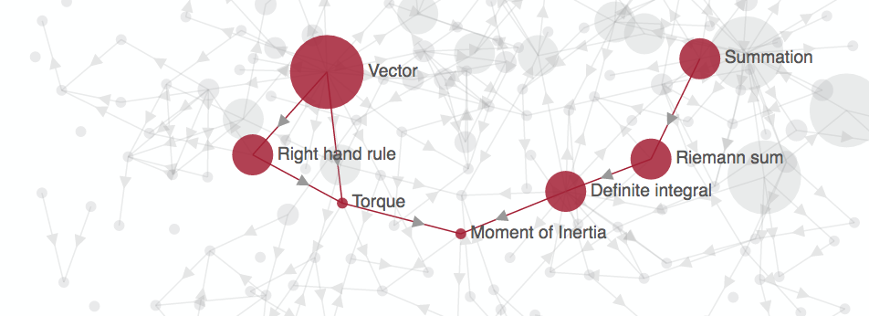
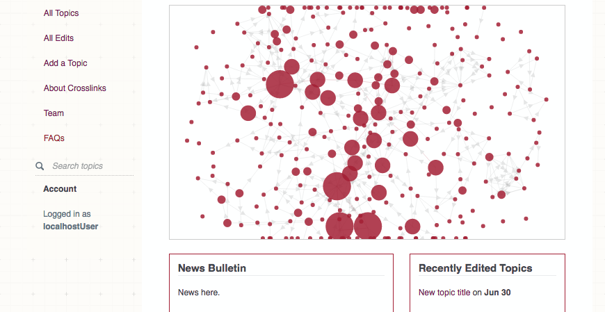

Crosslinks.js
===

Crosslinks ([crosslinks.mit.edu](http://crosslinks.mit.edu)) is a web application that contains a compendium of topics, resources tagged with topics, and links across topics.

This repository, Crosslinks.js, is the front-end: it contains the code for what you see on the site and lets you host your own version of Crosslinks.

Crosslinks is open-source: you are free to use, modify and reuse any part of it. If you do, please attribute and cite MIT Crosslinks:

**Miller, H.R, Willcox, K.E., Huang, L. "Crosslinks: Improving course connectivity using online open educational resources," in The Bridge, National Academy of Engineering, to appear 2016.**

Crosslinks is a project by [Karen E. Willcox](http://kiwi.mit.edu), MIT Professor of Aeronautics & Astronautics, and Haynes Miller, MIT Professor of Mathematics. The development of Crosslinks was funded by MIT ODL Strategic Education Initiatives, who also provided the backend service.

## How to use Crosslinks
This repo is for anyone who wants to host their own Crosslinks. You'll need your own backend service so you can store your collection of topics and linkages.

## Getting Started

If you want to host your own version of Crosslinks, the first thing to do is to download this repo so you can make modifications to it. Your machine needs to be running node [v0.10](https://nodejs.org/en/) or higher and [npm](https://npmjs.org/) in order to serve and develop the code.

First step is to download this repository onto your development machine:
```
git clone https://github.com/wombats-writing-code/crosslinks-js.git
```

`cd` into the newly-cloned directory. Then, to install all required dependencies:
```
npm install
```

We use the [Gulp](gulpjs.com) task runner to watch for changes in the `app/` directory and compile our files into the `dist/` folder. This job takes ~3 seconds and compiles SASS into normal CSS, and bundles our HTML and Javascript files into one big bundle, `bundle.js`. The bundling is actually managed by the [Webpack library](https://webpack.github.io/
), but in our `gulfile.js`, we tell Gulp to run Webpack.


We start the Gulp task runner by doing:
```
gulp watch
```

Your browser should fire up a window in which the Crosslinks code is being served locally. If you go to `http:localhost:9000` in your browser, you should see this:



What you are seeing here is the `dist/bundle.js` file that is getting served on your local server. You are seeing content here -- that visualization map, the Recently Edited Topics -- because Crosslinks.js has code that talks to our test database at MIT. **You need to change this code if you want Crosslinks to talk to your own database.** See the sections below on what you need to change.

Now, whenever you make changes to any HTML or Javascript files under `app/`, gulp will detect it and rebuild the code and serves it. Due to some quirks, **you have to refresh the page twice to see your latest changes**. Try it. Change the `app/modules/main/main.html` file -- your page should refresh, but remember to refresh it again!

If any of the above was confusing, here is some recommended reading:

* [A helpful overview of SPAs](http://www.seguetech.com/blog/2013/04/18/what-is-single-page-application)
* [Modularity in Javascript](http://eloquentjavascript.net/10_modules.html)
* [Optional but excellent: Building modular Javascript apps](http://addyosmani.com/writing-modular-js/)
* [Loading Javascript modules](https://libraryinstitute.wordpress.com/2010/12/01/loading-javascript-modules/)
* [webpack: module bundler and loader](https://github.com/webpack/webpack)
* Angular has a steep learning curve. [This guide helps](https://thinkster.io/a-better-way-to-learn-angularjs/)

## Code organization

Crosslinks is a Single Page App (SPA) that uses the [AngularJs *v1*](https://angularjs.org/) framework and is organized into modules using the CommonJs module specification. The Crosslinks application is front-end only, which means you'll need to set up your own server-side solution if you want to edit and put "real" authentication on it.

For example, at MIT, Crosslinks is world-readable - anyone in the world can read and access content. But, only MIT-authenticated users can edit. We do this by setting up an http version and an https version. The front-end shows the editing pages only when there is an MIT username present on the client. We then really secure this by having our API accept only requests with valid MIT logins.

All app stuff is found in `app/`.

From here on, we assume you're in the `app/` directory. Most likely you're interested in the actual Javascript logic, found in `modules/`. The entry file to the module loader is `index.js` and contains all routes (aka "pages") and their loading logic.

Modules are pretty much as described; there exists one folder for each route, and there's a `modules/common/` folder that houses all the common stuff shared throughout the app. For example, that visualization that is currently on the main page? -- that code resides in `modules/common/components/visualization`.


## Data Modeling

The core unit of Crosslinks is a `Topic`. The factory function and prototype definition can be found in `app/modules/common/models/topic.js`. Topics have the following attached:
* an array of `Subject` (look at `app/modules/common/models/subject.js`)
* an array of `reference` (the Wikipedia and Wolfram links)
* an array of `learn`  (links to resources that help you learn the current Topic)
* an array of `prepare`  (Topics that come before the current one)
* an array of `relate`  (Topics that are related to the current one)
* an array of `apply`  (links to resources that apply the current Topic)
* an array of `advance`  (Topics that follow on after the current one)

## Overview of the code you need to change

The section on Data Modeling above is required reading. This list is a bit lengthy, but fortunately, most of these modifications have to do with your server endpoints. Files you'll need to modify:

* app/modules/components/search-subject/searchSubject.service.js
* app/modules/components/search-topic/searchTopic.service.js

* app/modules/handcar/[everything] -- Provides functions to call against handcar, our server-side logic. You'll need to rewrite these functions to fit your API endpoints.
* app/modules/common/models/[everything] -- Provides factories and prototypes for models.
* app/modules/interceptors/[everything] -- This is some complicated logic to handle adapting requests and responses -- we need this because of the split authentication scheme we use at MIT Crosslinks. You might not.

### How to put in your own subjects
We highly recommend that you start here -- try to change where the subjects come from first, before changing anything else.

The file responsible for talking to the server where your subjects live:
```
app/modules/common/models/topic-repository/subject-repository.js
```

Try to substitute in your own server now. Does it work?

This file creates a `Subject` class instance from your data. **Every Subject must have a `name` and a `number`**:
```
app/modules/common/models/subject.js
```

### What to do if you don't want to manage your own backend and/or database
You can email us, [Karen E. Willcox](http://kiwi.mit.edu) and Luwen Huang at [kwillcox@mit.edu].
We'll put you in touch with our friends at [MIT SEI](https://odl.mit.edu/about/our-team/Strategic-Education-Initiatives), who managed our database and backend for us. They're really nice and might help you out.

## Help
For bugs and feature requests, please file an Issue on Github.


## Links
* [MIT Crosslinks website] (http://crosslinks.mit.edu)
* [Some context on Crosslinks] (http://kiwi.mit.edu/education/crosslinks)

## Papers
Miller, H.R, Willcox, K.E., Huang, L. "Crosslinks: Improving course connectivity using online open educational resources," in The Bridge, National Academy of Engineering, to appear 2016.

## Contact
Karen E. Willcox [kwillcox@mit.edu]

## License
This content is released under the [MIT License](http://opensource.org/licenses/MIT).
